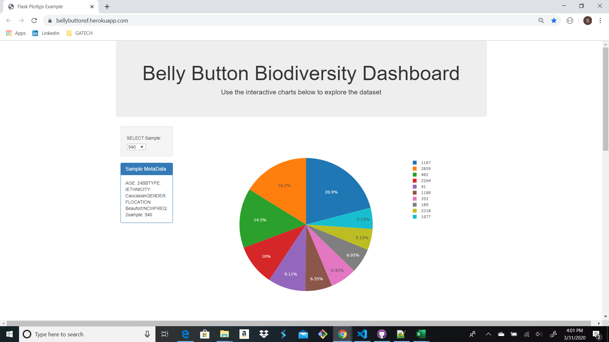
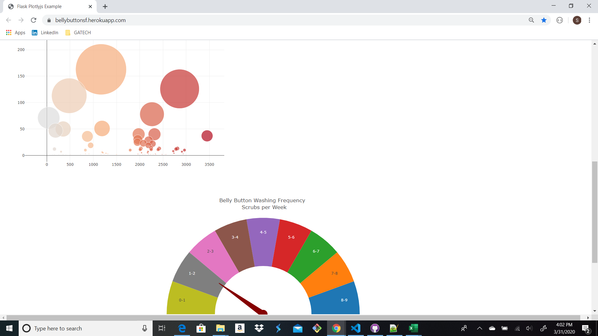

# Belly Button Biodiversity Dashboard Analysis

### plotly-challenge

---
## Data Visualization Dashboard

The Biodiversity Belly Button Analysis dashboard can be viewed by clicking the following link : https://bellybuttonsf.herokuapp.com/

---
## Plotly.js

The objective of this project was to utilize Plotly.js, HTML, CSS, Python, SQLITE and Flask to create a Pie Chart, Bubble Chart and Gauge Chart that is interactive based on the sample selected by the user. There were 2 seperate Datasets used, the Sample Id was the key value for each CSV file. The Pie Chart displays the top 10 samples; The Bubble Chart displays the metadata from each sample; The Gauge Chart displays the frequency range based on the sample id selected.

---
## Heroku

The Flask app of the Belly Button Biodiversity Dashboard was deployed to Heroku. See below:

